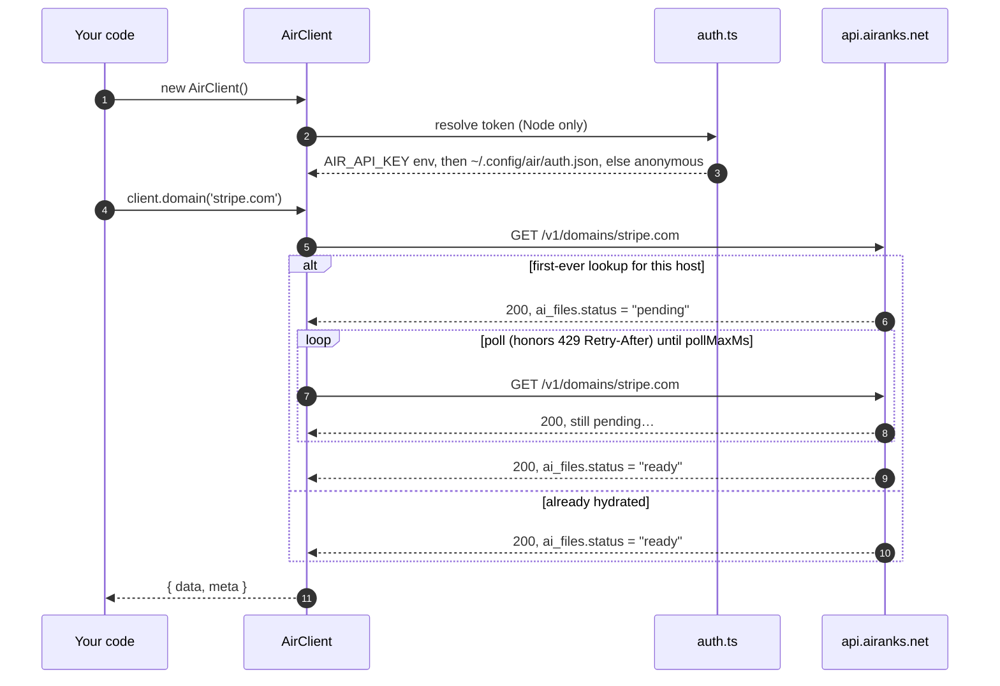
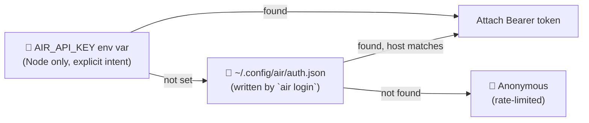

# 🟩 @airanks-net/sdk

**The official JavaScript / TypeScript SDK for the [AIR](https://airanks.net) API** — programmatic
access to AI Rank data for Node and the browser. Three methods, zero runtime dependencies, ships
its own types.

<p align="left">
  
  
  
  
  
  
</p>

## 🤔 What is AIR?

**AIR (Artificial Intelligence Ranking)** by **airanks** makes **AI optimization** visible: how
often, and how well, AI assistants like ChatGPT cite a given domain when answering real questions.
It's a 0–10 score per domain, backed by real observed citations, not a self-reported checklist.

Look up any site's AIR score at **[airanks.net](https://airanks.net)**, or install the
**[airanks toolbar](https://airanks.net/toolbar)** to see it while you browse.

This package is the JS/TS door into that same data — no CLI, no scaffolding, just a class with
three methods. 🚪

## 📚 Table of Contents

- [What is AIR?](#-what-is-air)
- [Install](#-install)
- [Quick Start](#-quick-start)
- [How it works](#-how-it-works)
- [Methods](#-methods)
- [Auth — shared across every AIR client](#-auth--shared-across-every-air-client)
- [Errors](#-errors)
- [TypeScript](#-typescript)
- [The `air` family](#-the-air-family)
- [License](#-license)

## 📦 Install

```bash
npm install @airanks-net/sdk
```

Requires **Node 18+** (for global `fetch`) server-side; any modern browser client-side.

## ⚡ Quick Start

```ts
import { AirClient } from '@airanks-net/sdk';

const client = new AirClient();

const { data: domain } = await client.domain('stripe.com');
console.log(domain.air_score); // 0-10

const { data: results } = await client.search('payment processing');

const who = await client.user(); // throws ApiError(401) if unauthenticated
```

See [`examples/lookup.mjs`](examples/lookup.mjs) for a fuller example with error handling —
run it with `npm run build && node examples/lookup.mjs`.

## 🧭 How it works

<details>
<summary><b>Request &amp; auth flow (click to expand)</b> 🖱️</summary>



</details>

`domain()` **always 200s** for a valid hostname. A never-before-seen domain triggers server-side
hydration behind the scenes, so the SDK polls automatically while `ai_files.status === "pending"`,
honoring `429 Retry-After` along the way. If the poll budget (`pollMaxMs`, default 180s) runs out
while still pending, it resolves with `pendingAtCap: true` instead of throwing — treat `air_score`
as **unknown**, not a real zero, in that case.

## 🛠️ Methods

| Method | Returns | Notes |
|---|---|---|
| `domain(host, options?)` | `{ data, meta, pendingAtCap? }` | AIR score, percentile, and AI-file posture (`llms.txt`, `ai.txt`, `robots.txt` AI-agent rules, JSON-LD) for a hostname. Auto-polls while hydrating. `options.pollMs` (default 20s) and `options.pollMaxMs` (default 180s) are tunable. |
| `search(query)` | `{ data: { domains: [], brands: [], phrases: [] }, meta }` | Matches across everything AIR tracks. |
| `user()` | `AirUser` (`{ name, email }`) | The authenticated user for whichever token was resolved. Throws `ApiError` with `status === 401` if the token is missing, invalid, or revoked. |

## 🔐 Auth — shared across every AIR client

Resolution order (first hit wins), **identical to every other AIR client** — the `air` CLI and the
browser toolbar included — so logging in once with *any* of them authenticates this SDK too:



1. **`AIR_API_KEY` env var** (Node only) — explicit intent, always attaches.
2. **`~/.config/air/auth.json`** (Node only) — the file `air login` writes. A token loaded from
   here only attaches to requests aimed at the host it was saved for, so a repointed `apiBase`
   can't accidentally leak it elsewhere.
3. **Anonymous** — no token, subject to the anonymous rate limit.

> ℹ️ **One login, every client.** `AIR_API_KEY` env > `~/.config/air/auth.json` > anonymous — the
> same three-step resolution runs in this SDK, the `air` CLI, and the browser toolbar, so logging
> in once works everywhere.

In the **browser**, this SDK never reads env vars or touches disk — pass a token explicitly:

```ts
const client = new AirClient({ apiKey: 'your-air-token' });
```

Point at a different API base (staging, a mirror, etc.) with `AIR_API_BASE` (Node) or the
`apiBase` constructor option:

```ts
const client = new AirClient({ apiBase: 'https://staging.airanks.net/api/v1' });
```

## 🚨 Errors

Non-2xx responses reject with `ApiError`, which carries the HTTP status (`.status`) and, for a
`429`, the server's `Retry-After` seconds (`.retryAfter`) when present:

```ts
import { AirClient, ApiError } from '@airanks-net/sdk';

try {
  const { data } = await client.domain('example.com');
} catch (err) {
  if (err instanceof ApiError && err.status === 429) {
    // domain() already retries 429s internally up to its poll budget — this only
    // fires if that budget is exhausted while still throttled.
  }
}
```

## 🧩 TypeScript

Ships its own `.d.ts` types — `Domain`, `AiFiles`, `SearchResults`, `AirUser`, `ApiError`, and
more are exported from the package root:

| Export | Kind |
|---|---|
| `AirClient` | class |
| `ApiError` | class |
| `AirClientOptions`, `DomainOptions` | types |
| `Domain`, `AiFiles`, `ResponseMeta` | types |
| `DomainResponse`, `SearchResponse`, `SearchResults`, `SearchHit` | types |
| `AirUser` | type |

Both **ESM** (`import`) and **CommonJS** (`require`) builds are published; pick either without
configuration. Full contract details live in [`API-CONTRACT.md`](../API-CONTRACT.md) at the repo
root — the source of truth every `air` client (this SDK, the Node/Rust/Go CLIs, and the PHP
Composer package) implements identically.

## 🌐 The `air` family

This SDK is one client in the **airanks-net** open-source family, all speaking the same
[API contract](../API-CONTRACT.md) and sharing the same login:

| Client | What it is |
|---|---|
| [`node-cli`](../node-cli) | Reference `air` CLI implementation (Node) |
| [`rust-cli`](../rust-cli) | `air` CLI in Rust |
| [`go-cli`](../go-cli) | `air` CLI in Go |
| [`python-sdk`](../python-sdk) | Python SDK |
| [`composer-package`](../composer-package) | PHP/Composer package |
| [`mcp-server`](../mcp-server) | Model Context Protocol server — AIR for agents |
| [`chrome-extension`](../chrome-extension) | The [airanks toolbar](https://airanks.net/toolbar) |
| [`homebrew-tap`](../homebrew-tap) | `brew install` for the CLIs |

## 📄 License

**MIT** — see [LICENSE](LICENSE).

---

<sub>Built for **AI optimization** by the folks at **airanks** 🟩 · one score, every AI · <a href="https://airanks.net">airanks.net</a></sub>
